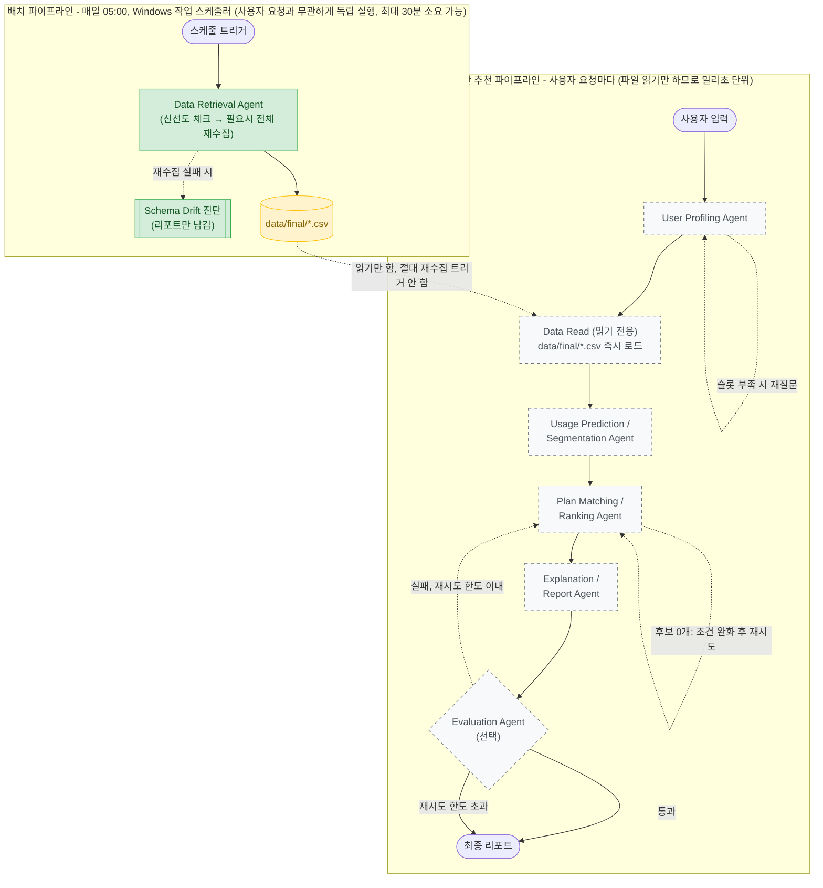

# 멀티에이전트 아키텍처 초안

기획서(ASAC SKB PDF)가 이미 7개 에이전트의 역할표와 1~7단계 흐름을 정의해 뒀다
([[project-plan-overview]] 메모리 참고). 그건 다시 만들지 않는다. 이 문서가
채우는 건 PDF에 없는 두 가지 - **① 실제 다이어그램**(PDF는 표와 번호 목록뿐,
그림이 없다)과 **② 우리 구현에 맞춘 상태 스키마·조건부 분기**다(PDF의 산출물
목록에 "메시지/상태 스키마"라고만 이름이 있고 내용은 프로젝트가 채워야 함).

## 전체 흐름 — 배치 파이프라인과 실시간 파이프라인은 반드시 분리한다

**초안 1차 버전에서 Data Retrieval Agent를 사용자 요청 경로 한가운데 그대로
넣었는데, 이건 실제로 사고가 났을 것이었다.** 이 프로젝트에서 KT+SKT+LGU+모요
전체 재수집이 실측으로 **약 28분** 걸렸다(오늘 세션에서 직접 겪음). 이 노드를
사용자 추천 요청과 같은 실행 안에 두면, 하필 데이터가 오래된 타이밍에 요청이
들어온 사용자는 추천을 받으려고 28분을 기다려야 한다 - 있어선 안 되는 일이다.

그래서 **완전히 분리된 두 파이프라인**으로 나눈다. 공유하는 건 오직
`data/final/*.csv` 파일뿐이다.

**초록(실선) = 구현됨, 회색(점선) = 미구현, 노란(원통) = 두 파이프라인이 공유하는
파일.** 지금은 배치 파이프라인의 Data Retrieval Agent + Schema Drift 진단만
실제로 돈다(`src/agents/`, README의 `schtasks` 등록이 이미 배치 트리거 역할).
실시간 파이프라인은 전부 미구현이고, 이 문서의 설계를 바탕으로 다음에 만든다.

**"Data Retrieval Agent"와 "Data Read"는 같은 게 아니다.** 지금 구현된
`data_retrieval_agent.py`는 신선도를 체크하고 필요하면 `refresh_plans.py`를
서브프로세스로 돌리는 **배치용 코드**다 - 매일 한 번 도는 스케줄러 안에서는
20~30분이 걸려도 문제없다(아무도 실시간으로 기다리지 않으므로). 실시간
파이프라인이 필요로 하는 건 그게 아니라 **그냥 `data/final/*.csv`를 읽기만 하는
훨씬 가벼운 함수**다 - 신선도 체크도, 재수집 트리거도 하면 안 된다. 이건 아직
안 만들었고, `data_retrieval_agent.py`의 `_read_csv`+`validate_output` 부분만
떼어서 별도 함수로 만들면 된다(신선도가 걱정되면 `data_as_of`만 같이 돌려줘서
Report Agent가 "이 데이터는 3일 전 기준입니다"라고 정직하게 표시하면 되지,
사용자를 기다리게 하면 안 된다).

Orchestrator는 별도 박스로 안 그렸다 - LangGraph에서는 오케스트레이터가 독립된
노드가 아니라 **그래프 자체(`graph.py`의 `add_node`/`add_conditional_edges`
배선)**이기 때문이다. "누가 다음에 실행되는가"를 정하는 게 오케스트레이터의
역할인데, 그게 바로 이 다이어그램의 화살표들이다. 배치와 실시간은 **서로 다른
그래프**(별도 `graph.py` 진입점)로 만들어야 하고, 하나의 그래프 안에서 조건부로
갈리는 게 아니다 - 완전히 다른 트리거(스케줄러 vs 사용자 요청)로 시작하기 때문이다.

## 진짜 "에이전트다운" 분기 2곳

지난 논의에서 짚었듯, 이 프로젝트 로직은 대체로 선형 파이프라인이라 멀티에이전트가
필수는 아니다. 그래도 아래 2곳은 **결과를 보고 스스로 판단해서 앞으로 되돌아가는**
지점이라 진짜 에이전트 행동에 가깝다.

### ① Plan Matching & Ranking Agent — 조건 완화 재시도

사용자 조건(예산·연령)으로 필터링했는데 후보가 0개면, "추천 불가"를 그냥
반환하지 않고 예산 상한을 단계적으로(예: +10%씩) 완화해 다시 찾는다. 무한 재시도를
막기 위해 `state.matching_retry_count`에 횟수를 남기고 `MAX_MATCHING_RETRIES`를
넘으면 "조건에 맞는 요금제가 없다"고 정직하게 반환한다. 이 경로를 테스트하려면
"예산 상한이 카탈로그 최저가보다 낮은" 입력이 필요하다.

### ② Evaluation Agent — 검증 실패 시 되돌리기

LLM-as-judge로 리포트의 논리적 일관성을 확인하고(예: "무제한이 필요하다고 했는데
무제한이 아닌 요금제를 추천했나"), 실패하면 Plan Matching으로 되돌아가 재시도한다.
`state.eval_retry_count`가 한도를 넘으면 최선의 결과를 그대로 반환하고
`state.eval_final_status`에 "미검증 통과"를 남긴다 - 검증에 걸렸다는 사실 자체를
숨기지 않는다(schema_drift가 회귀를 조용히 덮지 않고 리포트로 남기는 것과 같은
설계 원칙).

## 에이전트별 상세 설명

### User Profiling Agent

기획서가 지정한 기술요소 그대로 - **LLM 기반 슬롯 추출(함수 호출) + 입력값
검증**. 대화형 입력("저 유튜브 많이 보고 통화는 거의 안 해요, 한 달에 3만원
정도 쓰고 싶어요")에서 구조화된 `user_profile`을 뽑는다. 뽑을 슬롯 후보 -
`age`, `monthly_call_minutes`, `monthly_data_gb`, `monthly_sms_count`,
`monthly_budget_won`(선택 - 없으면 Plan Matching이 가격 랭킹만으로 정렬),
`ott_preference`, `preferred_carrier_type`, `data_unlimited_required`/
`voice_unlimited_required`/`sms_unlimited_required`, `contract_discount_ok`.

> **슬롯 스키마는 아직 확정 아니다.** 이전에 이 목록의 근거였던 합성 고객
> 데이터는 2026-08-10에 삭제했고(세그먼트 설계를 처음부터 다시 하기로 함),
> 위 목록은 요금제 카탈로그 컬럼에서 역으로 뽑은 것이다. 세그먼트를 다시
> 설계할 때 이 스키마도 같이 확정해야 한다.

**필수 슬롯이 비면 재질문한다**(다이어그램의 자기 자신 루프). 무엇이 "필수"인가:
나이는 항상 필수(연령 조건부 요금제 필터링에 쓰임), 그리고 데이터/통화 사용량
**또는** 예산 중 최소 하나는 있어야 Plan Matching이 점수를 매길 기준이 생긴다.
사용량도 예산도 전혀 모르겠다는 사용자는 Usage Prediction/Segmentation Agent의
폴백 경로(아래)로 넘어간다.

**검증**은 상식적인 범위만 - 나이가 음수거나 150세거나, 예산이 0 이하인 경우
등을 걸러서 재질문시킨다. 이 Agent는 매 사용자 요청마다 새로 실행되고
캐싱하지 않는다(사람마다 답이 다르므로).

### Data Read (읽기 전용)

배치 파이프라인 절 참고 - **신선도 체크·재수집 트리거를 절대 하지 않는다.**
`data_retrieval_agent.py`의 `validate_output()`이 이미 하는 4가지 검사(컬럼
누락, `plan_id` 중복, 고아 혜택, MNO/MVNO 0행)를 그대로 재사용해서 "지금 이
CSV가 구조적으로 멀쩡한가"만 확인하고 즉시 반환한다. `data_as_of`(마지막
배치 갱신 성공 날짜)를 같이 넘겨서, 혹시 배치가 며칠째 실패하고 있어도
사용자에게 오래된 데이터라는 사실을 Report Agent가 정직하게 알릴 수 있게 한다.

### Usage Prediction / Segmentation Agent

> **세그먼트 정의는 2026-08-10에 백지화됐다.** 기존 S1~S6 구간표와 그것으로
> 만든 합성 고객 데이터를 전부 삭제하고 처음부터 다시 설계하기로 했다.
> 아래 **역할 분담(규칙 기반 배정 vs 폴백 예측)은 그대로 유효**하고, 구간
> 경계값만 새로 정하면 된다.

두 가지 서로 다른 일을 한다.

1. **세그먼트 배정(대부분의 경우)**: User Profiling이 이미 실제 사용량 숫자를
   받아왔으면, 그 숫자가 이용형태 세그먼트 중 어느 구간에 드는지 규칙 기반으로
   바로 매칭한다 - ML이 필요 없다.
2. **세그먼트 예측(폴백 경로)**: 사용자가 본인 사용량을 모르겠다고 답한 경우에만,
   나이·대략적인 습관 답변으로 학습된 분류 모델(LGBM 등)이 세그먼트를 예측한다.
   지난 논의에서 짚었듯 이게 세그먼트 예측의 진짜 존재 이유다 - 메인 경로가
   아니라 "정보가 없을 때 메우는" 경로.

**사용량 예측(회귀)**은 기존 가입자(3개월 이용 이력이 있는 경우)에만 의미가
있다. 팀 설계의 가중평균 방식을 그대로 쓴다 - 오래된 달 20% / 중간 달 30% /
최근 달 50% 가중평균에 10% 안전 여유를 더해 "다음달 필요량"을 추정한다(단순
평균이 아니라 최근 추세를 반영). 신규 상담자는 이력이 없으므로 세그먼트
구간의 중앙값을 그대로 쓴다.

> 3개월 이용 이력은 실서비스라면 통신사가 갖고 있는 값이지만, 지금 이
> 리포지터리에는 **그런 데이터가 없다**(합성본을 지웠으므로). 이 경로를 만들려면
> 데이터를 먼저 다시 설계해야 한다.

### Plan Matching & Ranking Agent

재시도 로직은 위 "① 조건 완화 재시도" 참고. 정상 경로(후보가 있을 때)는:

1. **필터**: 나이 자격(`age_condition`), `*_unlimited_required`가 true인데
   해당 항목이 무제한이 아닌 요금제 제외, 예산 상한 이하
2. **점수**: 팀 설계의 가중치(데이터 35% · 테더링 15% · 통화 10% · 문자 5% ·
   가격 35%)를 실제 컬럼(`data_gb`, `tethering_gb`, `voice_minutes`,
   `sms_count`, `discounted_fee`)에 적용해 항목별 점수를 내고 가중합
3. 점수 순 정렬 후 상위 N개 반환

`ott_preference`는 필터가 아니라 **가점**으로 반영한다 - 없다고 후보에서
빼버리면 안 되고(OTT 없는 저렴한 요금제도 여전히 좋은 선택일 수 있음), 있으면
그 OTT를 포함한 요금제(`ott_options` 컬럼)에 보너스 점수를 주는 식이다.

### Explanation & Report Agent

후보 목록 + 점수 + `user_profile`로 자연어 리포트를 만든다. 기획서/팀 설계에
있던 사유 문구 패턴을 그대로 템플릿으로 쓸 수 있다 - "최근 평균 데이터
사용량을 충분히 제공함", "현재보다 월 8,000원 저렴함", "통화·문자 모두
무제한", "청년 할인 적용 가능" 등. 혜택 세부사항(OTT 등급, 멤버십 조건 등)은
`benefits.csv`에서 가져와 RAG처럼 결합할 수 있다. `data_as_of`가
`REFRESH_INTERVAL_DAYS`보다 오래됐으면 리포트에 그 사실도 명시한다 - Data
Read가 넘겨준 신선도 정보를 여기서 소비하는 것.

### Evaluation Agent (선택)

위 "② 검증 실패 시 되돌리기" 참고.

## 에이전트별 역할 · 상태 스키마 · 구현 상태 (요약표)

### 배치 파이프라인 (매일 05:00, 최대 30분 소요 가능 - 사용자는 절대 이걸 기다리지 않는다)

| 에이전트 | 역할 | State에서 읽는 것 | State에 쓰는 것 | 상태 |
|---|---|---|---|---|
| Data Retrieval | 신선도 판단 → 필요시 4개 사이트 전체 재수집 → 파싱 → 검증. 결과를 `data/final/*.csv`에 씀 | - | `plans`, `benefits`, `data_refreshed`, `data_stale_aborted`, `data_as_of`, `data_validation_errors`, `drift_report_path`, `drift_regressed` | **구현됨** (`data_retrieval_agent.py`) |
| └ Schema Drift 진단 | 재수집 후 사이트 구조 변경(파싱 회귀) 진단 | `plans` 재수집 여부 | `drift_report_path`, `drift_regressed` (위 항목에 포함) | **구현됨** (`schema_drift.py`, Data Retrieval이 호출) |

### 실시간 추천 파이프라인 (사용자 요청마다, 파일 읽기 외엔 네트워크 요청 없음)

| # | 에이전트 | 역할 | State에서 읽는 것 | State에 쓰는 것 | 상태 |
|---|---|---|---|---|---|
| - | Orchestrator | 노드 순서·조건부 분기 제어 | (그래프 구조 자체) | (그래프 구조 자체) | 미구현 |
| 1 | User Profiling | 사용자 입력에서 통화량·데이터·문자량·연령·예산·선호 추출. 슬롯 부족하면 재질문 | `user_input_raw` | `user_profile`(dict), `profiling_complete`(bool) | 미구현 |
| - | Data Read (읽기 전용) | `data/final/*.csv`를 그대로 로드 + 구조 검증. **신선도 체크·재수집 트리거 절대 안 함** | - | `plans`, `benefits`, `data_as_of` | 미구현 (`validate_output`/`_read_csv`를 배치 코드에서 분리해 재사용) |
| 2 | Usage Prediction / Segmentation | 사용자를 이용형태 세그먼트로 분류, 다음달 사용량 예측(회귀) | `user_profile` | `predicted_segment`(str), `predicted_usage`(dict) | 미구현 (**세그먼트 정의부터 재설계 중** — 2026-08-10 백지화) |
| 3 | Plan Matching & Ranking | 조건 필터링 + 가중합 스코어링으로 상위 N개 산출, 후보 0개면 조건 완화 재시도 | `user_profile`, `plans`, `benefits`, `predicted_segment` | `candidate_plans`(list), `ranking_scores`(dict), `matching_retry_count`(int) | 미구현 |
| 4 | Explanation & Report | 추천 사유를 자연어로 생성. `data_as_of`가 오래됐으면 그 사실도 같이 알림 | `candidate_plans`, `ranking_scores`, `user_profile`, `data_as_of` | `report_text`(str), `recommendation_reasons`(list) | 미구현 |
| 5 | Evaluation (선택) | 리포트 논리 검증, 실패 시 Plan Matching으로 되돌림 | `report_text`, `candidate_plans` | `eval_passed`(bool), `eval_retry_count`(int), `eval_final_status`(str) | 미구현 |

## 다음에 실제로 만들 때 참고할 것

- **배치 그래프와 실시간 그래프는 `src/agents/graph.py` 하나에 같이 넣지 않는다.**
  지금 `graph.py`(`START -> data_retrieval -> END`)는 **배치용으로 그대로 두고**,
  실시간 추천용은 `src/agents/live_graph.py` 같은 별도 진입점으로 만드는 걸
  추천한다. 상태 스키마(`AppState`)는 공유해도 되지만, 그래프(어떤 노드가 어떤
  트리거로 도는지)는 분리해야 이번에 짚은 문제가 다시 안 생긴다.
- **"Data Read" 노드부터 만든다.** `data_retrieval_agent.py`의 `_read_csv`
  (`PLAN_OUT`/`BENEFIT_OUT` 읽기)와 `validate_output` 부분만 떼어서 별도
  함수로 만들면 된다 - `is_stale()`/`subprocess.run(refresh_plans.py)` 부분은
  절대 가져오면 안 된다.
- `src/agents/state.py`의 `AppState`에 위 표의 "State에 쓰는 것" 컬럼을 그대로
  필드로 추가하면 된다(배치 파이프라인 부분은 이미 있음).
- 실시간 그래프의 조건부 분기 2곳(Plan Matching 재시도, Evaluation 되돌리기)은
  `add_conditional_edges`의 라우터 함수가 `state["matching_retry_count"]`/
  `state["eval_passed"]`를 보고 다음 노드를 정하면 된다.
- User Profiling Agent를 제일 먼저 만드는 걸 추천한다 - 여기서 정하는
  `user_profile` 스키마가 나머지 전부(세그먼트 예측·매칭·리포트)의 입력
  기반이라, 먼저 확정해야 뒤가 안 흔들린다. 초안의 근거였던 합성 고객 데이터는
  삭제했으므로, 이번에는 **요금제 카탈로그에서 실제로 필터·스코어에 쓰이는
  컬럼**(`age_condition`, `data_gb`/`data_unlimited`, `tethering_support`,
  `voice_minutes`, `sms_count`, `discounted_fee`, `ott_options`)에서 역으로
  필요한 슬롯을 정하는 편이 안전하다 - 물어봐도 매칭에 안 쓰이는 값을 슬롯에
  넣지 않게 된다.
