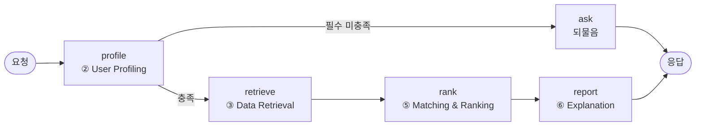

# 멀티에이전트 설계서

추천 요청 한 건이 어떤 순서로 처리되는지, 각 노드가 무엇을 책임지고 무엇을 주고받는지.

구현은 `src/graph.py`(LangGraph). **노드는 기존 순수 함수를 부르기만 한다.** 로직을
노드 안에 넣지 않은 이유는 아래 [설계 원칙](#설계-원칙)에 적었다.

---

## 흐름



`rank` 안에서 결과가 0건이면 조건을 하나씩 풀어 재시도한다(아래 [완화](#0건일-때-완화)).

## 노드

| 노드 | 원문 에이전트 | 하는 일 | 부르는 함수 |
|---|---|---|---|
| `profile` | ② User Profiling | 자유입력·폼 → 슬롯 → 질의. 필수가 비면 되물을 문장 | `profile_input.update_slots` / `to_query` |
| `retrieve` | ③ Data Retrieval | 요금제 테이블 + 가성비 점수 적재 (프로세스당 1회) | `fair_price.attach_value_score` |
| `rank` | ⑤ Plan Matching & Ranking | 필터 → 점수 → 정렬 → 상위 5개. 0건이면 완화 | `recommend.relax` / `ott_note` |
| `report` | ⑥ Explanation & Report | 추천 근거를 문장으로 | `report.write_report` |
| `ask` | — | 되물음만 남기고 종료 | — |

원문 ④ Usage Prediction / Segmentation은 **실서비스 경로에 없다.** 방식 비교 실험
(`src/compare_methods.py`)에서만 쓴다. 격자 200칸 비교에서 세그먼트 방식이 예산의
48.6%, 데이터 조건의 67.0%를 어겼기 때문이다. 원문 ⑦ Evaluation도 온라인이 아니라
같은 비교 리포트가 대신한다.

## 상태 스키마

`src/graph.py`의 `State`. 한 번의 추천 요청이 이 하나로 표현된다.

| 키 | 타입 | 채우는 노드 | 설명 |
|---|---|---|---|
| `text` | `str` | 호출자 | 자유입력 문장. 없어도 된다 |
| `form` | `dict` | 호출자 | 폼 값. **LLM 추출보다 우선한다** |
| `slots` | `dict` | profile | 지금까지 모인 슬롯 |
| `question` | `str` | profile | 되물을 문장. 있으면 추천을 하지 않는다 |
| `query` | `dict` | profile | `recommend()` 인자 8개 |
| `plans` | `DataFrame` | retrieve | 요금제 + `fair_price` · `value_score` |
| `results` | `DataFrame` | rank | 상위 5개 |
| `dropped` | `list[str]` | rank | 0건이라 푼 조건 |
| `note` | `str` | rank | OTT 안내 |
| `need_budget` | `int` | rank | 다 풀어도 0건일 때 필요한 최소 예산 |
| `report` | `str` | report / ask | 사람이 읽는 문단 |

## 입력 슬롯 8개

필수는 **예산과 데이터** 둘뿐. 나머지는 비우면 필터를 통과한다.

| 슬롯 | 필수 | 받는 방식 | 쓰이는 곳 |
|---|---|---|---|
| `budget` | ✅ | 숫자 | 필터 |
| `data_gb` / `data_unlimited` | ✅ | 구간 5개, 모르면 습관 4개 | 필터 |
| `voice_unlimited` | | 체크박스 | 필터 |
| `sms_unlimited` | | 체크박스 | 필터 |
| `mvno_ok` | | 결과 화면 토글 | 필터 |
| `age` | | 숫자 | 필터(연령 전용 요금제) |
| `ott_want` | | 다중 선택 | **가점** |
| `ott_required` | | "이것만 보기" 토글 | 필터(사용자가 켤 때만) |
| `current_fee` | | 숫자 | 절감액 계산만 |

## 0건일 때 완화

입력 조합 240칸 중 36칸(15%)이 조건을 만족하는 요금제가 없다. 빈 화면 대신
조건을 하나씩 풀고, **무엇을 풀었는지 반드시 함께 돌려준다.**

```
OTT 필수 → 문자 무제한 → 통화 무제한 → 연령 조건 → 알뜰폰 제외
```

**예산과 데이터는 절대 풀지 않는다.** 사용자가 명시한 핵심 조건이고, 몰래 풀면
못 내는 돈을 추천하게 된다. 다 풀어도 0건이면 `min_budget_for()`로 *"예산을 월
7,000원까지 올리면 추천할 수 있습니다"*를 대신 말한다.

## LLM을 쓰는 곳과 가둬둔 방식

LLM은 두 군데뿐이고, **둘 다 없어도 추천은 나온다.**

| 위치 | 하는 일 | 실패하면 |
|---|---|---|
| `profile_input.extract_slots` | 자유입력 → 슬롯 | 빈 dict. 폼 값으로 추천 |
| `report.write_report` | 결과 → 설명 문단 | 규칙으로 조립한 문장 |

지킨 제약 셋:

1. **요금제를 고르지 않는다.** 순위는 `recommend()`가 정하고 LLM은 설명만 한다.
2. **우리가 아는 값만 통과시킨다.** 모델이 `{"budget": "삼만원"}`을 뱉으면
   `build_query()`가 `InputError`로 막고, 모르는 데이터 구간은 버린다.
3. **모델이 체계적으로 틀리는 패턴은 코드가 덮는다.** `"3만원대"`를 30,000으로
   잡아 정작 3만원대 요금제를 다 잘라내던 것, `"50GB"`를 `50~100GB` 구간(요구량
   100GB)으로 올려 잡던 것은 문장에서 직접 읽어 교정한다.

리포트는 1위 요금제 이름이 문장에 없으면 통째로 버리고 규칙 문장으로 갈아친다.

## 설계 원칙

**로직을 노드 안에 넣지 않는다.** 웹(`src/api.py`)·노트북(`compare_methods.py`)·
에이전트가 **같은 `recommend()`를 부른다.** 노드로 옮기면 노트북 실험과 실서비스가
다른 코드를 쓰게 되고, 각 모듈에 걸어 둔 자체 검증 60여 개가 무의미해진다.

각 파일은 `python src/<파일>.py`로 자체 검증을 돌린다.

```
schema.py          분류 규칙 15건
recommend.py       필터·정렬·중복제거·완화·OTT 가점
fair_price.py      회귀 누수·성능·잔차
profile_input.py   입력 검증·구간 경계·5턴 대화
report.py          사실만 전달하는지
graph.py           되물음·정상·0건 경로
api.py             엔드포인트 응답 형태
make_synthetic.py  합성 데이터 자기정합성
```

## 실행

```bash
uvicorn api:app --reload --app-dir src   # 백엔드 :8000
cd web && npm run dev                    # 프런트 :5173
```

CLI로 한 번만 돌려볼 수도 있다.

```bash
python src/graph.py "3만원대 50기가 쓰는데 넷플릭스 있으면 좋겠어"
```
